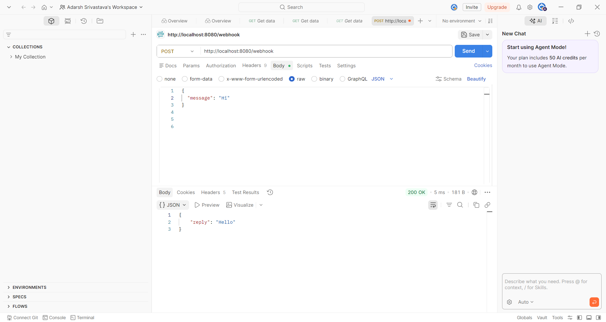
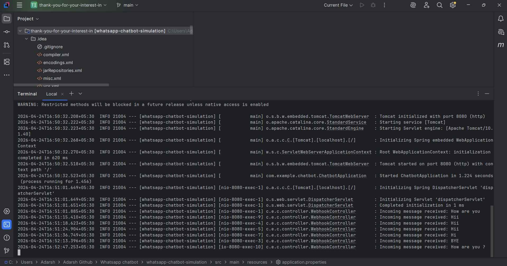
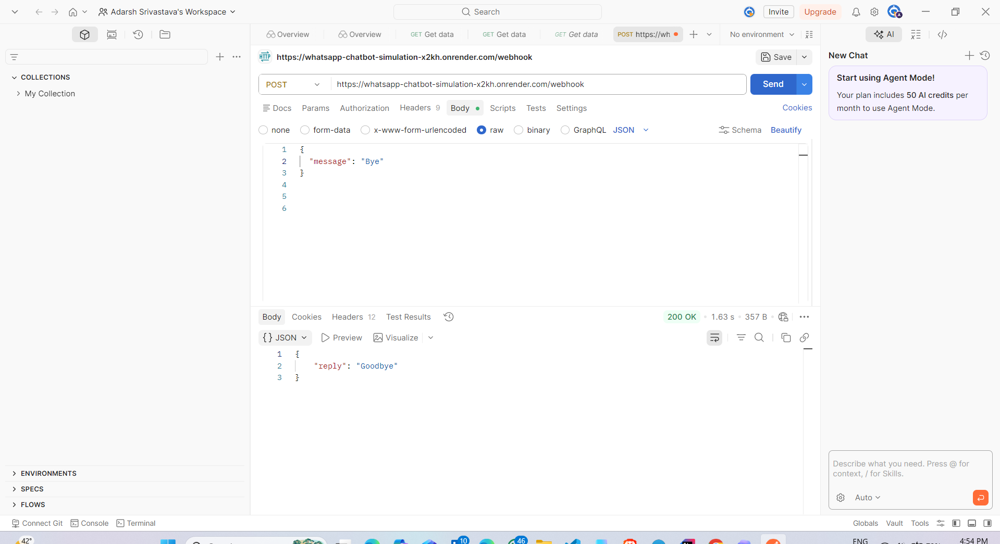
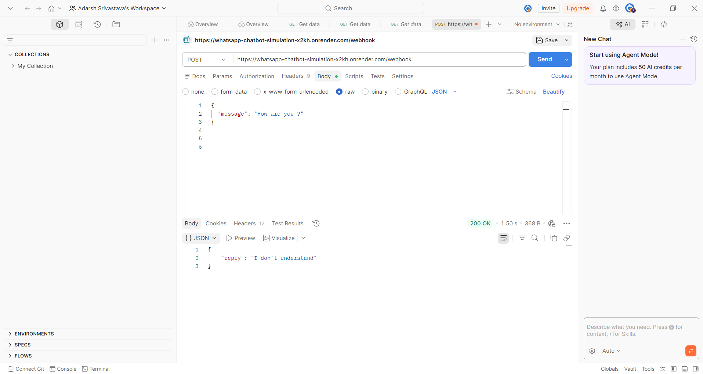

<div align="center">


# 🤖 WhatsApp Chatbot — Backend Simulation

> A simple layered Spring Boot REST API that simulates a WhatsApp chatbot webhook — built to demonstrate REST API development, request validation, and service-layer testing.

</div>

---

## 📖 Overview

This project simulates the **server-side webhook** of a WhatsApp chatbot. When a user sends a message via WhatsApp Business API, WhatsApp forwards it to your webhook as a `POST` request. This application replicates that flow locally — receiving JSON payloads, processing them through a dedicated service layer, and returning appropriate replies.

Rather than hardcoding logic in the controller, the project follows a **Controller → Service → DTO** separation, making it easy to extend with a database, NLP engine, or real WhatsApp Business API in the future.

---

## Live Demo

- GitHub Repository: https://github.com/Adarsh-afk661/whatsapp-chatbot-simulation
- Render Deployment: https://whatsapp-chatbot-simulation-x2kh.onrender.com

> Note: The `/webhook` endpoint accepts only `POST` requests, so opening it directly in the browser may show `404` or `405`, which is expected behavior.

---

## 🏗️ Architecture

```
HTTP Client (Postman / WhatsApp)
        │
        ▼
┌──────────────────────┐
│  WebhookController   │  ← Receives POST /webhook, delegates to service
└──────────┬───────────┘
           │
           ▼
┌──────────────────────┐
│   ChatbotService     │  ← Business logic: message matching, logging
└──────────┬───────────┘
           │
           ▼
┌──────────────────────┐
│  MessageRequest /    │  ← DTOs for clean request-response contracts
│  MessageResponse     │
└──────────────────────┘
```

---

## 🗂️ Project Structure

```
src/
├── main/
│   ├── java/com/example/chatbot/
│   │   ├── ChatbotApplication.java          # Spring Boot entry point
│   │   ├── controller/
│   │   │   └── WebhookController.java       # POST /webhook endpoint
│   │   ├── dto/
│   │   │   ├── MessageRequest.java          # Incoming message model
│   │   │   └── MessageResponse.java         # Outgoing reply model
│   │   └── service/
│   │       └── ChatbotService.java          # Reply logic + console logging
│   └── resources/
│       └── application.properties
└── test/
    └── java/com/example/chatbot/service/
        └── ChatbotServiceTest.java          # Unit tests for service layer
```

---

## ⚙️ Prerequisites

Ensure the following are installed on your machine:

| Requirement | Version | Check Command |
|-------------|---------|---------------|
| JDK | 17+ | `java -version` |
| Maven | 3.8+ | `mvn -version` |

---

## 🚀 Getting Started

### 1. Clone the repository

```bash
git clone https://github.com/Adarsh-afk661/whatsapp-chatbot-simulation.git
cd whatsapp-chatbot-simulation
```

### 2. Build the project

```bash
mvn clean install
```

### 3. Run the application

```bash
mvn spring-boot:run
```

The server starts at: **`http://localhost:8080`**

> **Port conflict?** Run on a different port:
> ```bash
> mvn spring-boot:run "-Dspring-boot.run.arguments=--server.port=8081"
> ```

---

## 📡 API Reference

### `POST /webhook`

Accepts an incoming message and returns a chatbot reply.

**Request**

```http
POST /webhook
Content-Type: application/json
```

```json
{
  "message": "Hi"
}
```

**Response**

```json
{
  "reply": "Hello"
}
```

### Response Behavior

| Input Message | Response | Notes |
|---------------|----------|-------|
| `Hi` | `Hello` | Case-insensitive |
| `Bye` | `Goodbye` | Case-insensitive |
| *(blank / empty)* | `400 Bad Request` | Validation enforced |
| *(anything else)* | `I don't understand` | Default fallback |

> **Note:** Input is trimmed and matched case-insensitively — `" HI "`, `"hi"`, and `"Hi"` all return `Hello`.

---

## 🧪 Testing

### Run unit tests

```bash
mvn test
```

The `ChatbotServiceTest` covers:
- Correct reply for `Hi`
- Correct reply for `Bye`
- Default reply for unrecognized input
- Case-insensitivity behavior

### Manual testing with cURL

```bash
# Test Hi
curl -X POST http://localhost:8080/webhook \
  -H "Content-Type: application/json" \
  -d '{"message": "Hi"}'

# Test Bye
curl -X POST http://localhost:8080/webhook \
  -H "Content-Type: application/json" \
  -d '{"message": "Bye"}'

# Test unknown input
curl -X POST http://localhost:8080/webhook \
  -H "Content-Type: application/json" \
  -d '{"message": "What is the weather?"}'
```

---

## 📋 Console Logging

Every request is logged automatically to stdout:

```
2024-01-15 10:23:01 INFO  ChatbotService - Incoming message received: Hi
2024-01-15 10:23:45 INFO  ChatbotService - Incoming message received: Bye
2024-01-15 10:24:10 INFO  ChatbotService - Incoming message received: What is the weather?
```

---

## 📸 Screenshots

### Local API Test - Hi


### Console Logs


### Live Deployment on Render - Bye


### Live Deployment on Render - Unknown Message


---

## 🔭 Roadmap

Planned improvements for future iterations:

- [ ] **WhatsApp Business API integration** — connect to real Meta webhook
- [ ] **Persistent chat history** — store conversations in PostgreSQL / MySQL
- [ ] **Dynamic reply rules** — load responses from DB or YAML config instead of hardcoding
- [ ] **NLP intent matching** — replace exact-match with keyword/intent detection
- [ ] **Dockerization** — `Dockerfile` + `docker-compose.yml` for one-command setup
- [ ] **Cloud deployment** — deploy on Render, Railway, or AWS EC2

---

<div align="center">

**Built by [Adarsh Srivastava](https://github.com/Adarsh-afk661)**

*Internship Assignment — REST API Development with Java & Spring Boot*

</div>
